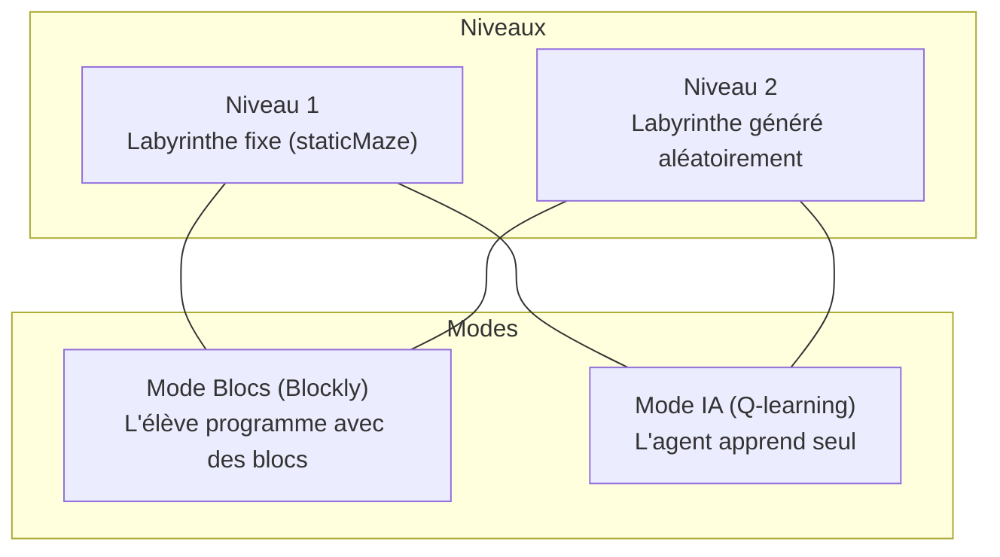
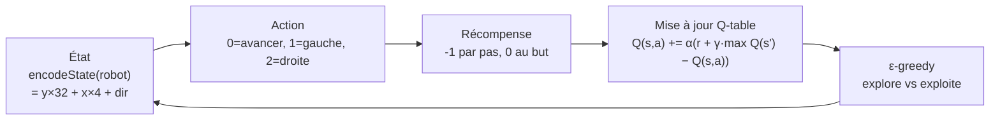

# Robot Blockly du labyrinthe

Activité éducative : l'élève programme un robot pour traverser un labyrinthe, d'abord manuellement avec Blockly (blocs visuels), puis observe un agent IA apprendre par Q-learning.

> **Stack :** HTML + CSS + Vanilla JS — fichier unique `index.html`, aucun bundler.  
> **Libs externes :** [Blockly](https://developers.google.com/blockly) (éditeur de blocs), messages FR.  
> **Déploiement :** GitHub Pages (workflow `.github/workflows/static.yml`).

---

## Architecture

Tout le code est dans `index.html` (~717 lignes). Il n'y a pas de fichiers JS séparés.

```
index.html          ← Tout : HTML structure, CSS inline, JS (Blockly + Q-learning + rendu Canvas)
favicon.ico         ← Icône du site
.github/workflows/  ← Déploiement GitHub Pages
```

---

## Modes et niveaux



| Mode | Contrôles affichés | Ce que ça fait |
|---|---|---|
| **Blockly** | « Tester mon programme » | Exécute le code Blockly de l'élève pas à pas sur le labyrinthe |
| **IA** | « Lancer une itération » + « Entraîner 100 fois » | Exécute des épisodes Q-learning, affiche le graphe de score |

| Niveau | Labyrinthe |
|---|---|
| **1** | `staticMaze` hardcodé (8×8) — toujours le même |
| **2** | Généré par `generateWallFollowerMaze()` — différent à chaque reset |

---

## Blocs Blockly disponibles

| Bloc | Code généré | Rôle |
|---|---|---|
| `start_block` | *(point d'entrée)* | Chapeau obligatoire en haut du programme |
| `move_forward` | `await moveForward()` | Avance d'une case dans la direction courante |
| `turn_left` | `await turnLeft()` | Tourne de 90° à gauche |
| `turn_right` | `await turnRight()` | Tourne de 90° à droite |
| `is_wall_ahead` | `isWallAhead()` | Retourne `true` si un mur bloque devant |
| + blocs standards | `controls_whileUntil`, `controls_if`, `logic_operation`, `logic_boolean` | Flot de contrôle |

---

## Q-learning (Mode IA)



### Paramètres

| Constante | Valeur | Rôle |
|---|---|---|
| `alpha` | `0.2` | Taux d'apprentissage |
| `gamma` | `0.8` | Facteur d'actualisation |
| `eps` | départ `1.0`, décroît | Taux d'exploration (ε-greedy) |
| `MAX_STEPS` | `128` | Pas max par épisode |
| `STEP_DELAY_MS` | `60` | Délai d'animation par pas (ms) |

### État et Q-table

- **État** : `y * 32 + x * 4 + dir` → 256 états possibles (8×8 grille, 4 directions)
- **Q-table** : tableau `[256][3]` — 3 actions par état
- **Decay de ε** : `eps = max(0.05, 0.9 × max(0, 1 − episodes/700))`

---

## Guide rapide pour modifier

### Changer le labyrinthe fixe (niveau 1)

Modifier `staticMaze` (~ligne 239). C'est un tableau 8×8 : `0` = passage, `1` = mur. Le robot démarre en `(0,0)`, le but est en `(7,7)`.

### Changer l'algorithme de génération de labyrinthe (niveau 2)

Modifier `generateWallFollowerMaze()` (~ligne 422). Utilise un DFS avec biais de direction. Le paramètre `straightBias` (défaut `0.8`) contrôle la tendance à aller tout droit.

### Ajouter un bloc Blockly

1. Ajouter la définition dans `Blockly.defineBlocksWithJsonArray([...])` (~ligne 197)
2. Ajouter le générateur de code dans `Blockly.JavaScript.forBlock['nom_du_bloc']` (~ligne 204)
3. Ajouter le bloc dans le `toolbox.contents` (~ligne 223)

### Modifier les paramètres Q-learning

Toutes les constantes sont groupées ~lignes 256-266 :
- `alpha`, `gamma` — apprentissage
- `MAX_STEPS` — durée max d'un épisode
- `STEP_DELAY_MS` — vitesse d'animation
- `SCORE_HISTORY_LIMIT` — nombre de points sur le graphe

### Modifier le reward

La fonction de récompense est dans `stepAction()` (~ligne 527) : retourne `0` au but, `-1` sinon. Pour encourager l'exploration, modifier cette logique.

### Changer la taille de la grille

Actuellement hardcodé à 8×8 partout (boucles, canvas, `encodeState`). Chercher les occurrences de `8` dans le JS pour les remplacer — attention à `encodeState` qui devra être adapté.

### Modifier les styles

Tout le CSS est dans le `<style>` en haut (~lignes 12-161). Variables CSS principales :
- `--bg: #f3f4f6` — fond de page
- `--surface: #ffffff` — panneaux
- `--accent: #2563eb` — boutons actifs, trail du robot
- `--line: #dfe3eb` — bordures
